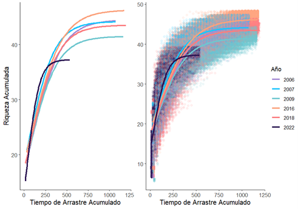

```{r setup, include=FALSE}
knitr::opts_chunk$set(echo = TRUE)
library("kableExtra")
library(gam.hp)
library(parameters)
library(GGally)
# library('grid')
library("plotly")
library(data.table)

options(scipen = 999)
options(warn = -1)

source(paste0(here::here(), "/analysis/2_plot_fits.R"))
```

Este es un proyecto liderado por la Licenciada Josefina Cuesta Nuñez (CIMAS-CONICET) y dirigido por los Dres. Alejandra Romero, Guillermo Svendsen y Matías Ocampo Reinaldo (CIMAS-CONICET).\
Guillermo me contacto para ayudar con el analisis de estos datos

Los analisis se encuentran en [**este repositorio**](https://github.com/adbpatagonia/GolfoSanMatiasDiversidad).

El repositorio no contiene los datos ni el borrador del manuscrito.\
Para poder replicar los analisis hay que copiar el archivo `datos_modelos_corregido.csv` (que me envio Guille) en la carpeta `data-raw`.

# Preguntas

La diversidad de especies en el Golfo San Matias se describe utilizando el indice Species Richness.\
Los datos fueron tomados a lo largo de 6 campañas entre 2006 y 2022. La campaña del 2022 fue diferente de las anteriores en algunos aspectos; fue realizada en un buque de investigacion y los tiempos de arrastre fueron estandarizados a 15 minutos, mientras que en campañas anteriores los lances fueron de \~30 minutos (con algo de variabilidad.

> Pregunta de investigación: En 2022 se reduce el tiempo de arrastre de 30 a 15 minutos, además se observan menos especies que en campañas anteriores. ¿Cambió la riqueza del GSM realmente o se debe a la reducción en esfuerzo de muestreo?

> Esperamos una relación positiva entre el tiempo de arrastre y la riqueza (a mayor tiempo de arrastre, mayor riqueza de especies).

> Además, considerando lo que ya se sabe del golfo, esperamos una relación positiva entre riqueza y longitud geográfica (del lance) y negativa entre riqueza y profundidad, así que incluí esas variables en los modelos."

Este es una primera aproximacion al problema. Naturalmente, este es un proceso interactivo: todos los analisis pueden ser modificados.

# Area de estudio     

Mapa del area de estudio    


Bathymetry data from https://www.ncei.noaa.gov/maps/bathymetry/  
DEM Global Mosaic
3 arc-seconds (90m)

```{r map, fig.width  = 9, fig.height = 9, echo=FALSE, message=FALSE, warning=FALSE}
p.map
```


# Datos

Numero de lances por año

```{r sets.anuales, fig.width  = 5, fig.height = 3, echo=FALSE, message=FALSE, warning=FALSE}
kable(fish.dat[, .N, keyby = Year]) %>%
  kable_styling(
    bootstrap_options = c("striped", "hover"),
    position = "center", full_width = FALSE
  )
```

Numero de lances por año con datos de profundidad

```{r sets.anuales.depth, fig.width  = 5, fig.height = 3, echo=FALSE, message=FALSE, warning=FALSE}
kable(fish.dat[!is.na(Depth), .N, keyby = Year]) %>%
  kable_styling(
    bootstrap_options = c("striped", "hover"),
    position = "center", full_width = FALSE
  )
```

Numero de lances por año con datos de area barrida

```{r sets.anuales.area, fig.width  = 5, fig.height = 3, echo=FALSE, message=FALSE, warning=FALSE}
kable(fish.dat[!is.na(area_barrida), .N, keyby = Year]) %>%
  kable_styling(
    bootstrap_options = c("striped", "hover"),
    position = "center", full_width = FALSE
  )
```

Numero de lances por año con datos de tiempo de arrastre

```{r sets.anuales.tiempo, fig.width  = 5, fig.height = 3, echo=FALSE, message=FALSE, warning=FALSE}
kable(fish.dat[!is.na(tiempo_arrastre2), .N, keyby = Year]) %>%
  kable_styling(
    bootstrap_options = c("striped", "hover"),
    position = "center", full_width = FALSE
  )
```
## Distribucion de frecuencia de los datos {#dist}

```{r plot.datos, fig.width  = 8, fig.height = 3, echo=FALSE, message=FALSE, warning=FALSE}
ggplotly(
  ggplot(mod.dat) +
    geom_histogram(aes(x = riqueza, fill = Year_fac,
                   text = paste("Year:", Year_fac,"<br>", "Riqueza:", riqueza,"<br>", "Lance:", lance)   )),
  tooltip = "text"
)
```

Registros continuos de profundidad. 

```{r plot.datos2, fig.width  = 8, fig.height = 3, echo=FALSE, message=FALSE, warning=FALSE}
ggplotly(
  ggplot(mod.dat) +
    geom_histogram(aes(x = Depth, fill = Year_fac,
                       text = paste("Year:", Year_fac,"<br>", "Depth:", Depth,"<br>", "Lance:", lance)   )),
  tooltip = "text"
)
```

Los registros de longitud indican que los lances fueron hechos en lugares discretos.

```{r plot.datos3, fig.width  = 8, fig.height = 3, echo=FALSE, message=FALSE, warning=FALSE}
ggplotly(
  ggplot(mod.dat) +
    geom_histogram(aes(x = long, fill = Year_fac,
                       text = paste("Year:", Year_fac,"<br>", "Longitud:", long,"<br>", "Lance:", lance)   )),
  tooltip = "text"
)
```

El tiempo de arrastre tiene una distribucion bimodal, con todos los lances de 2022 durando 15 minutos, y el resto de los lances durando alrededor de 30 minutos, con un poco de variabilidad.\
El area barrida tambien tiene una distribucion bimodal, que corresponde a los dos picos de tiempo de arrastre.\
Entiendo que la mayor dispersion de los datos se debe a que el area barrida es una resultado de: i) tiempo de arastre, ii) velocidad del buque, iii) dimensiones de las redes utilizadas.\
Notese que hay un lance en 2007 con vaor de area barrida muy baja (\<0.02), y un lance de 2018 con area barrida baja (\<0.04). Hay algun error en el calulo de area barrida?

```{r plot.datos4, fig.width  = 8, fig.height = 3, echo=FALSE, message=FALSE, warning=FALSE}
ggplotly(
  ggplot(mod.dat) +
    geom_histogram(aes(x = tiempo_arrastre2, fill = Year_fac,
                       text = paste("Year:", Year_fac,"<br>", "TiempoArrastre:", tiempo_arrastre2,"<br>", "Lance:", lance)   )),
  tooltip = "text"
)
ggplotly(
  ggplot(mod.dat) +
    geom_histogram(aes(x = area_barrida, fill = Year_fac,
                       text = paste("Year:", Year_fac,"<br>", "AreaBarrida:", area_barrida,"<br>", "Lance:", lance)   )),
  tooltip = "text"
)
```

## Riqueza como funcion de variables explicativas

La riqueza de especies incrementa durante los 3 primeros años, al parecer se mantiene hasta el cuarto survey (aunque hay varios años sin datos en el medio), y luego decae. Esta no-monoticidad descarta la posibilidad de modelar riqueza\~f(año) como un modelo lineal generalizado con año como variable continua.

```{r plot.datos5, fig.width  = 8, fig.height = 3, echo=FALSE, message=FALSE, warning=FALSE}
ggplotly(
  ggplot(mod.dat) +
    geom_point(aes(y = riqueza, x = Year, text=sprintf("Lance: %s", lance )),
               position = position_dodge2(width = 0.3), alpha = 0.4)
)
```

Tal como describio Josefina, hay una relacion negativa entre riqueza y profundidad. La relacion parece disminuir hasta alcanzar una asintota alrededor de riqueza = 12, pero con mucha variabilidad alrededor de la asintota.

```{r plot.datos5b, fig.width  = 8, fig.height = 3, echo=FALSE, message=FALSE, warning=FALSE}
ggplotly(
  ggplot(mod.dat) +
    geom_point(aes(
      y = riqueza, x = Depth,
      text=sprintf("Lance: %s", lance ),
      color = Year_fac
    ), alpha = 0.4)
)
```

Relacion positiva entre riqueza y longitud (correlacion negativa con profundidad).

```{r plot.datos6, fig.width  = 8, fig.height = 3, echo=FALSE, message=FALSE, warning=FALSE}
ggplotly(
  ggplot(mod.dat) +
    geom_point(aes(
      y = riqueza, x = long,
      text=sprintf("Lance: %s", lance ),
      color = Year_fac
    ), alpha = 0.4)
)
```

No veo relacion clara entre riqueza y area barrida o tiempo de arrastre. Lo unico que veo es que en 2022 no se registraron riquezas mayores a 18. Sin embargo, solo hay `r  nrow(fish.dat[Year < 2022 & riqueza > 18])` registros con riqueza mayor a 18 entre 2006 y 2018 (`r round(100 * nrow(fish.dat[Year < 2022 & riqueza > 18])/nrow(fish.dat[Year < 2022 ]))`% de los registros previos a 2022). Notese que el dato con riqueza=23 y area barrida \< 0.04 corresponde a 2018

```{r plot.datos7, fig.width  = 8, fig.height = 3, echo=FALSE, message=FALSE, warning=FALSE}
ggplotly(ggplot(mod.dat) +
           geom_point(aes(y = riqueza, x = area_barrida,
                          text=sprintf("Lance: %s", lance ),
                          color = Year_fac), alpha = 0.4))

ggplotly(ggplot(mod.dat) +
  geom_point(aes(y = riqueza, x = tiempo_arrastre2, 
                 text=sprintf("Lance: %s", lance ),
                 color = Year_fac), alpha = 0.4))


# ggplotly(
#   ggplot(fish.dat) +
#     geom_point(aes(y = riqueza, x = Depth, color = as.factor(Year)), alpha = 0.4) +
#     geom_smooth(aes(y = riqueza, x = Depth, color = as.factor(Year),  fill = as.factor(Year))) +
#     facet_wrap(.~Year)  +
#     theme(legend.position = 'bottom',
#           legend.title = element_blank())
# )
```

<!-- ## Curva de acumulacion de especies -->

<!-- Tome esta curva del manuscrito que escribio Josefina.\ -->
<!-- Si recuerdo correctamente (pero muy probablemente este equivocado), esto quiere decir que el survey de 2022 describio correctamente la comunidad existente. En caso de incrementar el esfuerzo pesquero hasta el infinito, la diversidad no hubiese aumentado. Si mi interpretacion es correcta, creo que son buenas noticias dado que en ese caso se puede comparar la riqueza obtenida en 2022 con las riquezas previas. -->

<!--  -->

## Variables explicativas de interés      


En charlas con Guille, él me expresó que están intersados en como la riqueza de especies puede ser descripta por:      

   * Profundidad: se conoce que existe una relación clara entre profundidad y riqueza (@Svendsen2020)     
   * Longitud: *"bay effect"* (@Svendsen2020)     
   * Tiempo de arrastre: queremos dilucidar si la aparente reduccion de riqueza de especies registrada en 2022 se puede explicar por el menor tiempo de arrastre    
   * Interacciones entre las variables anteriores, sobre todo con tiempo de arrastre   
   * Año: queremos ver si podemos diferenciar el efecto de tiempo de arrastre


## Correlaciones entre variables explicativas

Hay correlacion entre:

-   Area barrida y tiempo de arrastre (`pearson r =` `r round(cor(mod.dat[,(area_barrida)], mod.dat[,(tiempo_arrastre2)]), 2)`). Utilicé tiempo de arrastre como variable explicativa.\
-   Profundidad y longitud (`pearson r =` `r round(cor(mod.dat[,(Depth)], mod.dat[,(long)]), 2)`). A pesar de la correlación que existe, incluí las 2 variabls en los modelos. Guille me explicó que la información que contienen estas 2 variables son diferentes; longitud contiene información biogeográfica mientras que profundidad contiene información a una escala más localizada. Esta correlación debe ser tenida en cuenta al momento de interpretar los resultados.\
-   Año y area barrida (`pearson r =` `r round(cor(mod.dat[,(Year)], mod.dat[,(area_barrida)]), 2)`): esto esta dado porque en 2022 se muestreo de manera diferente. .\
-   Año y tiempo de arrastre (`pearson r =` `r round(cor(mod.dat[,(Year)], mod.dat[,(tiempo_arrastre2)]), 2)`): *Idem* area barrida.

```{r corr, fig.width  = 8, fig.height = 3, echo=FALSE, message=FALSE, warning=FALSE}
p.corr.mod.dat
```

Esta tabla muestra la multicolinearidad (@zuur_etal_2010) entre las variables retenidas (excluyendo área barrida). Todas son \< 2, por lo que podemos incluirlas sin inconvenientes en los modelos.

```{r multocollinearity, echo=FALSE, message=FALSE, warning=FALSE}
kable(multico) %>%
  kable_styling(
    bootstrap_options = c("striped", "hover"),
    position = "center", full_width = FALSE
  )
```

# Metodos

Dada que las relaciones entre variables explicativas y riqueza no son monotónicas, utilicé Generalized Additive Models (GAM, @Wood_2017).      

Ajusté 4 modelos, detallados más abajo, y los comparé utilizando AIC.    
En todos los modelos incluí el efecto de año de muestreo como intercepto aleatorio, para capturar potenciales diferencias inter-anuales y para contrastar el efcto del 2022 con el efecto de tiempo de arrastre

**Modelos:**     

  * <u>Solo efectos principales:</u>    
`gam(
  riqueza ~
    s(Depth, bs = "tp") +
    s(long, bs = "tp") +
    s(tiempo_arrastre2, bs = "tp") +
    s(Year_fac, k = length(levels(mod.dat$Year_fac)), bs = "re"),
  method = "ML",
  data = mod.dat
)`
 
  * <u>Interacción triple:</u>    
`gam(
  riqueza ~
    s(Depth) +
    s(long) +
    s(tiempo_arrastre2) +
    s(Year_fac, k = length(levels(mod.dat$Year_fac)), bs = "re") +
    ti(Depth, long, tiempo_arrastre2) ,
  method = "ML",
  data = mod.dat
)`

  * <u>Interacción doble entre tiempo de arrastre y longitud:</u>     
  `gam(
  riqueza ~
    s(Depth) +
    s(tiempo_arrastre2) +
    s(long) +
    s(Year_fac, k = length(levels(mod.dat$Year_fac)), bs = "re") +
    ti( tiempo_arrastre2, long) ,
  method = "ML",
  data = mod.dat
)`
  
  * <u>Interacción doble entre tiempo de arrastre y profundidad:</u>      
  `gam(
  riqueza ~
    s(Depth) +
    s(long) +
    s(tiempo_arrastre2) +
    s(Year_fac, k = length(levels(mod.dat$Year_fac)), bs = "re") +
    ti(tiempo_arrastre2, Depth) ,
  method = "ML",
  data = mod.dat
)`

I calculated the individual contributions of each predictor of the most parsimonious model towards explained deviance using the function `gam.hp` from the package `gam.hp` (@Lai_etal_2024).

# Resultados

## Model selection    

Esta tabla tiene:    

  * <u>Modelo</u>: estos son los modelos descriptos mas arriba    
  * <u>df</u>: effective degrees of freedom. Estos son los numeros de parametros incluidos en el calculo de AIC    
  * <u>LL</u>: logLikelihood, medida de ajuste. Modelos con mayor LL ajustan mejor
  * <u>dev</u>: deviance, medida de ajuste. Modelos con menor deviance ajustan mejor
  * <u>rsq</u>: r-squared     
  * <u>deltaAIC</u>: $\Delta{AIC}$
  * <u>er</u>: Evidence ratio. *"Evidence ratios also have a raffle ticket interpretation in qualifying the strength of evidence. For example, assume two models, A and B with the evidence ratio = L(gA|data)/L(gB|data) = 39. I might judge this evidence to be at least moderate, if not strong, support of model A. This is analogous to model A having 39 tickets while model B has only a single ticket"* (@anderson2008model).    
  
  
  EL modelo más parsimonioso es el modelo que incluye una interacción entre longitud y tiempo de arrastre. Los otros 3 modelos tienen un ajuste muy similar entre ellos.  
  A partir de aquí, interpretaré los resultados del modelo mas parsimonioso.   

```{r modelselection, echo=FALSE, message=FALSE, warning=FALSE}
kable(ms) %>%
  kable_styling(
    bootstrap_options = c("striped", "hover"),
    position = "center",
    row_label_position = "left",
    full_width = FALSE
  )
```

## Best Model      

### Model residuals    

Estos son los residuales del modelo mas parsimonioso    


```{r resids, echo=FALSE, message=FALSE, warning=FALSE}
appraise(m.3) 
```


### Efectos parciales de variables explicativas         


Estos son los efectos parciales del modelo más parsimonioso.     

Es importante notar que cada gráfico tiene diferentes eje Y, es decir que hay variables que tienen efecto mucho mayor (x ej, profundidad). 

Efecto de profundidad (pvalue: `r round(data.table(parameters::parameters(m.3))[grepl(x = Parameter, pattern = "Depth"), (p)], 4) `): exponencialmente negativa hasta alrededor de 120 m, y mas alla de esa profundidad el efefecto aumenta y luego baja.    

Efecto de tiempo de arrastre (pvalue: `r round(data.table(parameters::parameters(m.3))[grepl(x = Parameter, pattern = "arrastre2)"), (p)], 4) `): mucho menor que el efecto de profundidad (ver la escala del eje Y). Es una relacion lineal positiva; esto es un proxy de año ya que se registro menor diversidad el año en el que el tiempo de arrastre fue menor (2022).     

Efecto de longitud (pvalue: `r round(data.table(parameters::parameters(m.3))[grepl(x = Parameter, pattern = "long") & !grepl(x = Parameter, pattern = ","), (p)], 4) `): efecto lineal, aumenta la riqueza a medida que uno se mueve de oeste a este.    

Efecto de año (pvalue: `r round(data.table(parameters::parameters(m.3))[grepl(x = Parameter, pattern = "Year"), (p)], 4) `): `r simulate_parameters(m.3) %>% 
data.table() %>% 
filter(grepl(pattern = "Year", x = Parameter)) %>% 
mutate(year = unique(mod.dat$Year)) %>% 
select(year, Coefficient) %>% 
arrange(desc(Coefficient)) %>% 
pull(year)`.     

Efecto de interaccion entre longitud y tiempo de arrastre (pvalue: `r round(data.table(parameters::parameters(m.3))[grepl(x = Parameter, pattern = ","), (p)], 4) `): esta interacción es un poco complicada interpretarla a partir de este gráfico. Este efecto será mas claro en la próxima seccion. 


Más allá de que el efecto de año no es estadísticamante significativo, lo mantuve porque desde el punto de vista teórico tiene sentido considerar que esta variable representa potenciales diferencias interanuales en el estado del ecosistema.    

```{r partialeffects, echo=FALSE, message=FALSE, warning=FALSE}
draw(m.3) +
  theme_minimal() +
  scale_fill_viridis_c()
```


```{r summary.m.3, echo=FALSE, message=FALSE, warning=FALSE}
summary(m.3)
```


### Particion de deviance explicada por el mejor modelo         

Esta es una participación porcentual de la deviance explicada por el modelo

-   Profundidad: `r p.var.part$data[which(grepl(x = p.var.part$data$variable, pattern = "Depth")), "value"]`%\    
-   Longitud: `r p.var.part$data[which(grepl(x = p.var.part$data$variable, pattern = "long") & !grepl(x = p.var.part$data$variable, pattern = ",")), "value"]`%\   
-   Año: `r p.var.part$data[which(grepl(x = p.var.part$data$variable, pattern = "Year")), "value"]`%    
-   Tiempo de arrastre: `r p.var.part$data[which(grepl(x = p.var.part$data$variable, pattern = "arrastre2)")), "value"]`%
-   Interacción: `r p.var.part$data[which(grepl(x = p.var.part$data$variable, pattern = "arrastre2,")), "value"]`%

```{r relimp, fig.width  = 13, fig.height = 6, echo=FALSE, message=FALSE, warning=FALSE}
plot.gamhp(gam.hp(m.3), plot.perc = TRUE)
```


### Model fit      

Dado que el modelo mas parsimonioso tiene 3 efectos principales (sin considerar año): profundidad, longitud y tiempo de arrastre, eso define que el modelo debe ser visualizado en 4 dimensiones.   
Para hacer una aproximación, hice 2 graficos en 3D.   
En ambos casos:   

  * Eje Z: Riqueza de especies    
  * Eje Y: Profundidad    
  
En el primer caso:   

  * Eje X: longitud    
  * 3 superficies: valores de tiempo de arrastre de 20, 30, y 40 minutos    
  * los datos están codificados con respecto a tiempo de arrastre (ver escala)


Aquí se ve claramente el efecto de profundidad, la riqueza decae a medida que la profundidad aumenta.  
El efecto de la interacción entre tiempo de arrastre y longitud se ve al girar un poco el gráfico - se ve que los planos se cruzan alrededor de -64.6. Con tiempos de arrastre más cortos, el efecto de longitud es menos pronunciado que con tiempos de arrastre más largos. 


```{r mfit.time, fig.width  = 8, fig.height = 8, echo=FALSE, message=FALSE, warning=FALSE}
p.fit.4d.time
```


En el segundo caso:   

  * Eje X: tiempo de arrastre       
  * 3 superficies: valores de longitud  -64, -64.4, y -64.8   
  * los datos están codificados con respecto a longitud (ver escala)    
  
Aquí es notable por qué en los lances hechos mas al oeste (longitud -64.8) el efecto del tiempo de arrastre es menor (hay varios datos con baja riqueza que actuan como ancla).   
También es claro que el efecto de tiempo de arrastre es positivo: con tiempos de arrastre de 15 minutos la riqueza es baja, y aumenta con tiempo de arraste de 30 minutos.   
  
```{r mfit.long, fig.width  = 8, fig.height = 8, echo=FALSE, message=FALSE, warning=FALSE}
p.fit.4d.long
```


# Conclusiones         

-   Parece haber algo sospechoso con algunos de los registros de area barrida. Quizas seria bueno repasar que los calculos esten bien hechos.\      
-   La variable que explica la mayor cantidad de variabilidad es Profundidad.\ 


-  El haber cambiado de metodologia tuvo un efecto negativo sobre la riqueza de especies observada (la riqueza observada en 2022 fue menor). Este efecto se ve en los efectos parciales de tiempo de arraste. Dado que 2022 fue el único año en que se usó esta nueva metodología, no es posible distinguir si este efecto es porque la riqueza fue de hecho menor (en el ecosistema) en 2022, o las diferencias estan dadas por las diferencias en el muestreo. Asumo que el tiempo de arrastre no fue la única diferencia en el muestreo. Probablemente otras diferencias sean en el arte de pesca utilizada, dimensiones, velocidad de arrastre, etc.    


 

-   Este ejercicio no puede determinar si la menor riqueza registrada en 2022 es debido a:

* menor riqueza en el ecosistema, ó
* haber cambiado la metodología de muestreo

esta diferenciación quizas se pueda hacer en el futuro si se continua muestreando con la misma metodologia que en 2022. Mientras tanto, se debera recurrir a lineas alternativas de evidencia, por ejemplo la curva de acumulacion de especies que produjo Josefina. 


# Updates May 2025

Luego de la reunion con el grupo de trabajo se decidio hacer estas actualizaciones:     


   * Incluir datos de 2024. Estos tienen tiempos de arrastre entre 15 y 25 minutos. Estos datos pueden ayudar a separar el efecto de año del efecto de tiempo de arrastre     
   * Incluir el efecto de la variable "lance": este es un identificador del lance. Es un identificador del lugar donde se realizo el lance. Lo incluiremos para tener en cuenta la correlacion espcaial (efecto aleatorio).       
   * cambiar la estructura del efecto de año. En este momento la estamos usando como una variable aleatorio (random intercept). La cambiaremos a una variable fija (continua, smooth effect).    
      
## Incluir Lance ID      

Inclui el efecto de lance como variable aleatoria al mejor modelo.   

`m.3.lance <- gam(
  riqueza ~
    s(Depth) +
    s(tiempo_arrastre2) +
    s(long) +
    s(lance, k = length(levels(mod.dat$lance)), bs = "re") +
    s(Year_fac, k = length(levels(mod.dat$Year_fac)), bs = "re") +
    ti(tiempo_arrastre2, long),
  method = "ML",
  data = mod.dat
)`

Elegi presentarlo de esta manera para evitar tener que repetir el ejercicio de seleccion de modelos. Pero inclui el efecto  a todos los modelos presentados, y los resultados son consistentes independientemente del modelo.  


El efecto de lance no es significativo (pvalue: `r round(data.table(parameters::parameters(m.3.lance))[grepl(x = Parameter, pattern = "lance"), (p)], 4) `)    

```{r summary.m.3.lance, echo=FALSE, message=FALSE, warning=FALSE}
summary(m.3.lance)
```


Incluir el efecto de Lance ID no mejora el ajuste del modelo 

logLik m.3: `r round(logLik(m.3), 1)`    
logLik m.3.lance: `r round(logLik(m.3.lance), 1)`     


Esto lo interpreto como eviencia de que el efecto de la locacion sobre la riqueza queda completamente descripta por los efectos de profundidad y longitud.    
Por lo tanto, no lo incluire en el modelo final.    

# Referencias
