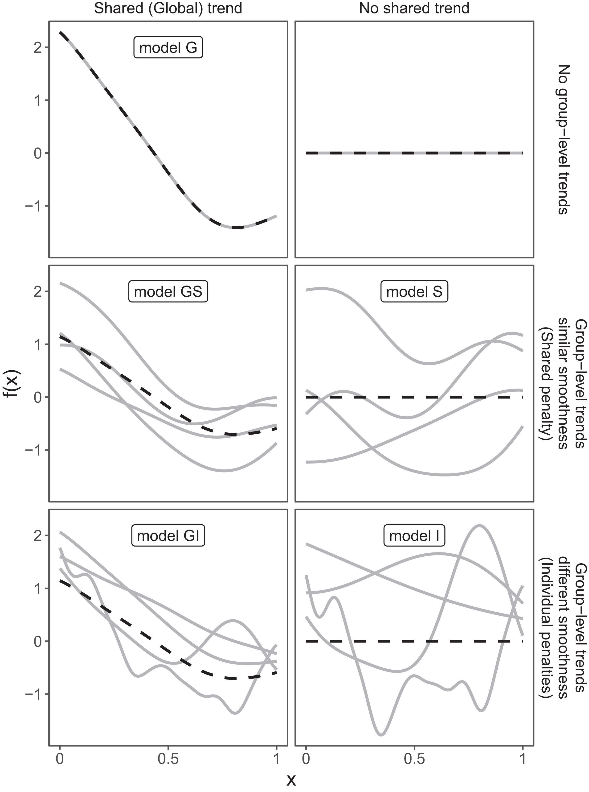

```{r setup, include=FALSE}
knitr::opts_chunk$set(echo = TRUE)
library('kableExtra')
library(gam.hp)
library(parameters)
# library('grid')
# library('plotly')
# library(data.table)

options(scipen = 999)
options(warn=-1)

source(paste0(here::here(), "/analysis/2_HGAMs.R"))

```

Este es un proyecto liderado por la Licenciada Josefina Cuesta Nuñez (CIMAS-CONICET) y dirigido por el Dr. Guillermo Svendsen (CIMAS-CONICET).      
Guillermo me contacto para ayudar con el analisis de estos datos

Los analisis se encuentran en [**este repositorio**](https://github.com/adbpatagonia/GolfoSanMatiasDiversidad).

El repositorio no contiene los datos ni el borrador del manuscrito.     
Para poder replicar los analisis hay que copiar el archivo `datos_modelos_jcn.csv` (que me envio Guille) en la carpeta `data-raw`.     

# Preguntas     

La diversidad de especies en el Golfo San Matias se describe utilizando el indice Species Richness.     
Los datos fueron tomados a lo largo de 6 campañas entre 2006 y 2022. La campaña del 2022 fue diferente de las anteriores en algunos aspectos; fue realizada en un buque de investigacion y los tiempos de arrastre fueron estandarizados a 15 minutos, mientras que en campañas anteriores los lances fueron de ~30 minutos (con algo de variabilidad. 

> Pregunta de investigación: En 2022 se reduce el tiempo de arrastre de 30 a 15 minutos, además se observan menos especies que en campañas anteriores. ¿Cambió la riqueza del GSM realmente o se debe a la reducción en esfuerzo de muestreo?     

> Esperamos una relación positiva entre el tiempo de arrastre y la riqueza (a mayor tiempo de arrastre, mayor riqueza de especies).   

> Además, considerando lo que ya se sabe del golfo, esperamos una relación positiva entre riqueza y longitud geográfica (del lance) y negativa entre riqueza y profundidad, así que incluí esas variables en los modelos."

Este es una primera aproximacion al problema. Naturalmente, este es un proceso interactivo: todos los analisis pueden ser modificados.    


# Datos     

## Distribucion de frecuencia de los datos    

```{r plot.datos, fig.width  = 8, fig.height = 3, echo=FALSE, message=FALSE, warning=FALSE}

ggplot(fish.dat) +
  geom_histogram(aes(x = riqueza))
```

Registros continuos de profundidad     
```{r plot.datos2, fig.width  = 8, fig.height = 3, echo=FALSE, message=FALSE, warning=FALSE}
ggplot(fish.dat) +
  geom_histogram(aes(x = Depth))
```

Los registros de longitud indican que los lances fueron hechos en lugares discretos. 
```{r plot.datos3, fig.width  = 8, fig.height = 3, echo=FALSE, message=FALSE, warning=FALSE}
ggplot(fish.dat) +
  geom_histogram(aes(x = long))
```

El tiempo de arrastre tiene una distribucion bimodal, con todos los lances de 2022 durando 15 minutos, y el resto de los lances durando alrededor de 30 minutos, con un poco de variabilidad.       
El area barrida tambien tiene una distribucion bimodal, que corresponde a los dos picos de tiempo de arrastre.     
Entiendo que la mayor dispersion de los datos se debe a que el area barrida es una resultado de: 1) tiempo de arastre, ii) velocidad del buque, iii) dimensiones de las redes utilizadas.      

```{r plot.datos4, fig.width  = 8, fig.height = 3, echo=FALSE, message=FALSE, warning=FALSE}

ggplot(fish.dat) +
  geom_histogram(aes(x = tiempo_arrastre2))

ggplot(fish.dat) +
  geom_histogram(aes(x = area_barrida))
```


## Riqueza como funcion de variables explicativas     

La riqueza de especies incrementa durante los 3 primeros años, al parecer se mantiene hasta el cuarto survey (aunque hay varios años sin datos en el medio), y luego decae. Esta no-monoticidad descarta la posibilidad de modelar riqueza~f(año) como un modelo lineal generalizado con año como variable continua.       

```{r plot.datos5, fig.width  = 8, fig.height = 3, echo=FALSE, message=FALSE, warning=FALSE}
ggplot(fish.dat) +
  geom_point(aes(y = riqueza, x = Year), position = position_dodge2(width = 0.3), alpha = 0.4)
```

Tal como describio Josefina, hay una relacion negativa entre riqueza y profundidad. La relacion parece disminuir hasta alcanzar una asintota alrededor de riqueza = 12.      

```{r plot.datos5b, fig.width  = 8, fig.height = 3, echo=FALSE, message=FALSE, warning=FALSE}
ggplot(fish.dat) +
  geom_point(aes(y = riqueza, x = Depth), alpha = 0.4)
```

Relacion positiva entre riqueza y longitud (correlacion negativa con profundidad).     

```{r plot.datos6, fig.width  = 8, fig.height = 3, echo=FALSE, message=FALSE, warning=FALSE}
ggplot(fish.dat) +
  geom_point(aes(y = riqueza, x = long), alpha = 0.4)
```

No veo ninguna relacion entre riqueza y area barrida o tiempo de arrastre. Lo unico que veo es que en 2022 no se registraron riquezas mayores a 18. Sin embargo, solo hay `r  nrow(fish.dat[Year < 2022 & riqueza > 18])` registros con riqueza mayor a 18 entre 2006 y 2018 (`r round(100 * nrow(fish.dat[Year < 2022 & riqueza > 18])/nrow(fish.dat[Year < 2022 ]))`% de los registros previos a 2022).      

```{r plot.datos7, fig.width  = 8, fig.height = 3, echo=FALSE, message=FALSE, warning=FALSE}
ggplot(fish.dat) +
  geom_point(aes(y = riqueza, x = area_barrida), alpha = 0.4)

ggplot(fish.dat) +
  geom_point(aes(y = riqueza, x = tiempo_arrastre2), position = position_dodge2(width = 0.15), alpha = 0.4)

# ggplotly(
#   ggplot(fish.dat) +
#     geom_point(aes(y = riqueza, x = Depth, color = as.factor(Year)), alpha = 0.4) +
#     geom_smooth(aes(y = riqueza, x = Depth, color = as.factor(Year),  fill = as.factor(Year))) +
#     facet_wrap(.~Year)  +
#     theme(legend.position = 'bottom',
#           legend.title = element_blank()) 
# )
```

## Curva de acumulacion de especies        

Tome esta curva del manuscrito que escribio Josefina.           
Si recuerdo correctamente (pero muy probablemente este equivocado), esto quiere decir que el survey de 2022 describio correctamente la comunidad existente. En caso de incrementar el esfuerzo pesquero hasta el infinito, la diversidad no hubiese aumentado. Si mi interpretacion es correcta, creo que son buenas noticias dado que en ese caso se puede comparar la riqueza obtenida en 2022 con las riquezas previas.    

  

## Correlaciones entre variables explicativas   

Hay correlacion entre:    

  * Area barrida y tiempo de arrastre (`pearson r = 0.692`). Esto quiere decir que no podemos incluir ambas en un modelo. Creo que area barrida es probablemente un mejor descriptor de la cantidad de especies capturadas porque integra los efectos de tiempo de arrastre, tipo de red y velocidad del buque. Sin embargo, modele riqueza como funcion de area barrida y tiempo de arrastre de manera separada y llegua la misma conclusion.       
  * Profundidad y longitud (`pearson r = 0.422`). Desde un punto de vista biologico, creo que profundidad afecta la distribucion de las spp por lo que retuve esa variable.               
  * Año y area barrida (`pearson r = -0.42`): esto esta dado porque en 2022 se muestreo de manera diferente. Inclui las dos variables en el modelo y fue tomado en cuenta al modelar.     
  * Año y tiempo de arrastre (`pearson r = -0.6`): *Idem* area barrida.      

```{r plot.correlations, fig.width  = 10, fig.height = 6, echo=FALSE, message=FALSE, warning=FALSE}
ggpairs(mod.dat[,.( Year, area_barrida, tiempo_arrastre2 , Depth, long)],
        lower = list(continuous = wrap("points", alpha = 0.4), combo = "facethist", discrete = "facetbar", na =
                       "na"))
```

Este es el mismo grafico sin incluir longitud o tiempo de arrastre      

```{r plot.correlations2, fig.width  = 10, fig.height = 6, echo=FALSE, message=FALSE, warning=FALSE}
ggpairs(mod.dat[,.( Year, area_barrida, Depth)],
        lower = list(continuous = wrap("points", alpha = 0.4), combo = "facethist", discrete = "facetbar", na =
                       "na"))
```


Esta tabla muestra la multicolinearidad (@zuur_etal_2010) entre las variables retenidas. Todas son < 2, por lo que podemos incluirlas sin inconvenientes en los modelos.        

```{r multocollinearity, echo=FALSE, message=FALSE, warning=FALSE} 
kable(multico) %>%
  kable_styling(bootstrap_options = c("striped", "hover"))
```

# Metodos      

Dada que la relacion entre año y riqueza no es monotona, utilice Generalized Additive Models (GAM, @Wood_2017).     

## GAMs     

En una primera instancia, ajuste modelos de la forma: 

`gam(riqueza ~ s(Year, bs = "re) + s(Depth) + s(area_barrida))`, 
donde `s()` es una funcion "smooth" y `bs="re"` quiere decir que año fue incluido como una variable alatoria (random effect)      

                
y 

`gam(riqueza ~ s(Year, bs = "re) + s(Depth) + s(tiempo_arrastre2))`   
                
                
Esto me permitio evaluar si estas variables aportan a la descripcion de riqueza               

Nota: al trabajar con GAMs es uso comun estandarizar las variables explicativas. En este ejercicio, ajuste modelos con las variables estandarizadas y sin estandarizar, y dieron identicos resultados. Dado que es mas sencillo interpretar el output de los modelos de modelos ajustados con las variables sin estandarizar, decidi presentar estos.     

## Hierarchical GAMs        

El resultado del paso previo (ver mas abajo) fue que profundidad y año son importantes para explicar el indice de riqueza. Area barrida (o tiempo de arrastre) no fue importante para explicar el indice de riqueza.    
Luego me centre en la forma de la relacion entre las variables. Especificamente, me centre en analizar si la forma de la relacion riqueza~f(profundidad) es identica entre todos los años para los cuales se tomaron datos. Aqui incluyo una descripcion - me disculpo por el uso de ingles, esto lo tomé y adapté de otro documento que escribí para otro proyecto.            

Model structure is defined by three model choices:      

1. Should each year have its own smoother, or will a common smoother suffice?     
2. Do all of the year-specific smoothers have the same wiggliness, or should each year have its own smoothing parameter?     
3. Will the smoothers for each year have a similar shape to one another — a shared global smoother?   

This defines these 5 models (figure taken from @pedersen_etal_2019):    

These three choices result in five possible models (figure below taken from @pedersen_etal_2019):    
1. <u>Model G:</u> A single common smoother for all observations. It only has a Global smoother, and a year-specific intercept (identical to random intercepts in GLMMs).        
2. <u>Model GS:</u> A global smoother plus year-level smoothers that have the same wiggliness (analogue to random slopes in GLMMs)     
3. <u>Model GI:</u> A global smoother plus year-level smoothers with differing wiggliness.       
4. <u>Model S:</u> Year-specific smoothers without a global smoother, but with all smoothers having the same wiggliness.     
5. <u>Model I:</u> Year-specific smoothers with different wiggliness.     

      


I fit the 5 models, and carried out model selection based on AIC.  


I calculated the individual contributions of each predictor (Depth and Year) towards explained deviance using the function `gam.hp` from the package `gam.hp` (@Lai_etal_2024). 


All models were fitted using the `gam()` function in the `mgcv` package version 1.8-33 (@Wood_2011)

# Resultados         
## GAMs     
### area_barrida             

Estos son los efectos parciales del modelo  `gam(riqueza ~ s(Year, bs = "re) + s(Depth) + s(area_barrida))`.      
Efecto de profundidad: exponencialmente negativa hasta llegar una asintota alrededor de 130 m                
Efecto de año: 2016 > 2018 > 2009 > 2006 > 2022 > 2007          
Efecto de area barrida: casi nulo. Es una relacion lineal positiva, con pendiente muy cercana a cero.     

```{r fullmodel, fig.width  = 9, fig.height = 9, echo=FALSE, message=FALSE, warning=FALSE}
draw(m.rich.full_modG)
```

Resumen del ajuste del modelo. Año y profundidad son estadisticamente significativas, y area barrida no lo es.        
```{r fullmodel_summary, echo=FALSE, message=FALSE, warning=FALSE} 
parameters::parameters(m.rich.full_modG)
```

### Tiempo de arrastre        
Estos son los efectos parciales del modelo  `gam(riqueza ~ s(Year, bs = "re) + s(Depth) + s(tiempo_arrastre2))`.     
*Idem* modelo anterior. El efecto de tiempo de arrastre parece ser un poco mas fuerte que el de area barrida, pero notese que esta completamente dictado por el año 2022.   

```{r fullmodeltime, fig.width  = 9, fig.height = 9, echo=FALSE, message=FALSE, warning=FALSE}
draw(m.rich.full.time_modG)
```

Resumen del ajuste del modelo. La variable de tiempo de arrastre no es significativa.   
```{r fullmodeltime_summary, echo=FALSE, message=FALSE, warning=FALSE} 
parameters::parameters(m.rich.full.time_modG)
```

## Hierarchical GAMs          
Dados los resultados de la seccion anterior, retuve las variables profundidad y año, y descarte las variables descriptivas del esfuerzo pesquero.     

### Model selection      
El modelo mas parsimonioso es el modelo G: incluye un smoother global y efecto de año (random intercept).     
Los modelos GS (smoother global + smoothers especificos para cada año, todos con el mismo smoothness) y GI (smoother global + smoothers especificos para cada año, todos con diferente smoothness) no pueden ser completamente descartados.  
El ajuste (logLikelihood) es casi identico entre los 3 modelos. La diferencia en AIC y medidas derivadas (deltaAIC y Evidence Ratio (ei)) entonces estan dados completamente por la cantidad de parametros en los modelos.     
Los modelos que no contienen una tendencia global (I y S) pueden ser descartados. 

```{r modelselection, echo=FALSE, message=FALSE, warning=FALSE} 
kable(AIC(
  m.rich_modG,
  m.rich_modGS,
  m.rich_modGI,
  m.rich_modS,
  m.rich_modI ) %>%
  mutate(logLikelihood = c(
    logLik(m.rich_modG),
    logLik(m.rich_modGS),
    logLik(m.rich_modGI),
    logLik(m.rich_modS),
    logLik(m.rich_modI)
  )) %>%
  arrange(AIC) %>%
  mutate(deltaAIC = round(AIC - min(AIC), 2)) %>%
  mutate(wi = exp(-0.5 * deltaAIC)/sum(exp(-0.5 * deltaAIC))) %>% 
  mutate(er = max(wi)/wi) %>% 
  select(-wi))  %>%
  kable_styling(bootstrap_options = c("striped", "hover"))
```


### Efectos parciales de las variables     
#### Modelo G   

Efectos parciales de profundidad y año sobre indice de riqueza        
Efecto de profundidad: exponencialmente negativa hasta llegar una asintota alrededor de 130 m                
Efecto de año: 2016 > 2018 > 2009 > 2006 > 2022 > 2007          

```{r bestmod, fig.width  = 9, fig.height = 5, echo=FALSE, message=FALSE, warning=FALSE}
draw(bestmod)
```

#### Modelo GS   
El efecto parcial de Profundidad es identico al del modelo G.   
Este modelo no incluye el efecto parcial de random effect de año. 
Los efectos parciales de las relaciones año-especificas riqueza~f(profundidad) son todas lineas rectas con pendiente cercana a cero. Por lo tanto, estan actuando de hecho como interceptos año-especificos. Es decir, que no modifican para nada la relacion global entre riqueza y profundidad.      
```{r modGS, fig.width  = 9, fig.height = 5, echo=FALSE, message=FALSE, warning=FALSE}
draw(m.rich_modGS)
```


#### Modelo GI   
Los efectos parciales de Profundidad y año son identicos a los del modelo G
Los efectos parciales de las relaciones año-especificas riqueza~f(profundidad) son todas lineas casi rectas con pendiente cercana a cero. Por lo tanto, estan actuando de hecho como interceptos año-especificos. Es decir, que no modifican para nada la relacion global entre riquezay profundidad.      
```{r modGI, fig.width  = 9, fig.height = 5, echo=FALSE, message=FALSE, warning=FALSE}
draw(m.rich_modGI)
``` 


### Ajustes de modelos   
Auste de los 3 modelos mas parsimoniosos.     
El ajuste de los 3 modelos es identico.      
Notese que se solapan completamente (el grafico es interactivo, se pueden prender y apagar las lineas de los ajustes).    
Conclusion de este ejercicio: la relacion entre riqueza y profundidad no varia entre años.

```{r modelfits, fig.width  = 9, fig.height = 5,  echo=FALSE, message=FALSE, warning=FALSE}
ggplotly(
  ggplot(predictions) +
    geom_line(aes(x = Depth, y = fit, color = modelo, linetype = modelo), size = 1.3) +
    geom_point(data = mod.dat,
               aes(x = Depth, y = riqueza),
               alpha = 0.4) +
    facet_grid(.~Year_fac)  +
    ylab("Species Richness") +
    xlab("Depth (m)")) 
```

### Modelo G           

Ajuste del modelo mas parsimonioso          
```{r bestmodelfit, fig.width  = 9, fig.height = 5,  echo=FALSE, message=FALSE, warning=FALSE}
p.fit.bestmod +  xlab("Depth (m)")
```

Particion de deviance explicada por el mejor modelo:        

   * Profundidad: 67.5%                 
   * Año: 32.5%              
   
```{r relimp, fig.width  = 13, fig.height = 6, echo=FALSE, message=FALSE, warning=FALSE}
plot.gamhp(gam.hp(bestmod), plot.perc = TRUE)
```


# Conclusiones       

  * Las metricas que describen esfuerzo pesquero (tiempo de arrastre y area barrida) no explican la variabilidad en el indice de riqueza     
  * Las variables que explican la variabilidad del indice de riqueza son Profundidad y Año - profundidad es mas importante que año.     
  * La relacion entre riqueza y profundidad no varia entre años (la curva tiene la misma forma).    
  * El efecto del año es:  2016 > 2018 > 2009 > 2006 > 2022 > 2007. 
  Notese que el interecepto del año 2007 es menor que el intercepto del año 2022. EN particular, en 2007 hay muchos datos a baja profundidad, por lo que el intercepto debiera quedar bien definido, pero pocos datos a gran profundidad (no hay datos mas alla de 100 m).
 
  

# Referencias
